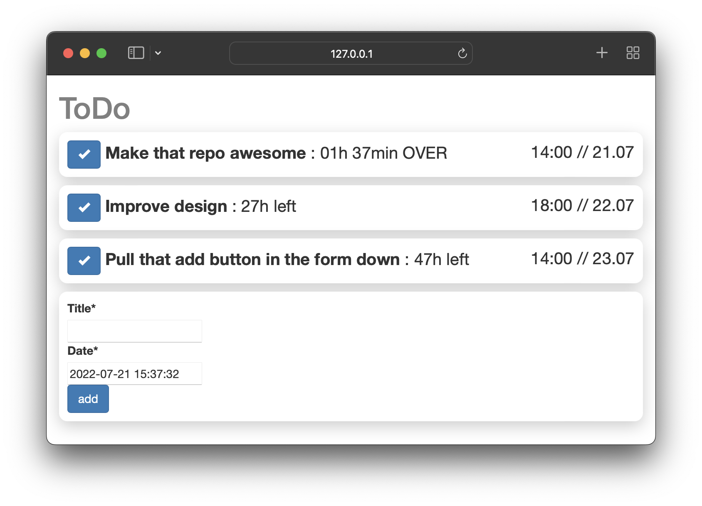

# ToDo-List

This is a playground, on which I work on a todo-list-webapp.
The website is built with python &amp; django. [This](https://www.geeksforgeeks.org/python-todo-webapp-using-django/) is the tutorial, which I used to get started.

## Cheat sheet to get started (MacOS / Linux)

1. Install general dependencies, such as python 3 and django
2. Install django & django crispy forms (In my case, I installed it directly, without a virtual environment)
   `pip install django`
   `pip install django-crispy-forms`
3. Go to project root directory
4. Start the webserver with sqlite etc. locally
   `python manage.py runserver`
5. Go to http://127.0.0.1:8000/ – there is your new website!

At the end, you should get something like this:

For further steps, look at the tutorial above. Also, don't expect too efficient, well thought code as I am still a beginner dealing with django & websites.

## Troubleshooting Tipps

- If you run into problems regarding the sqlite3 database – such as any columns are missing etc., the following commands could help:
  `bash python manage.py makemigrations` or
  `bash python manage.py migrate` or
- You could also delete all precompiled python files: just delete every "**pycache**" folder.

...and, if you going to be serious with this project or want to put the project on a server reachable by the internet, CHANGE THE SECRET KEY (located in `todosite/settings.py`)

Have fun with the code!
